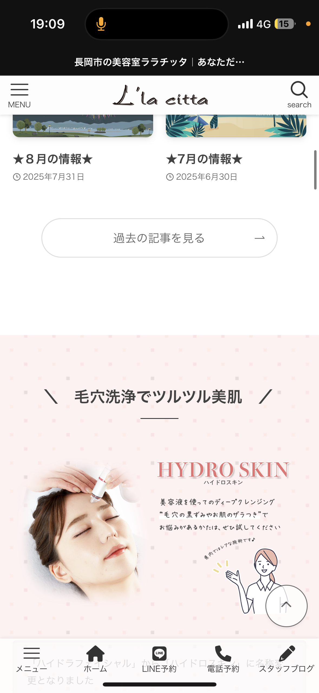
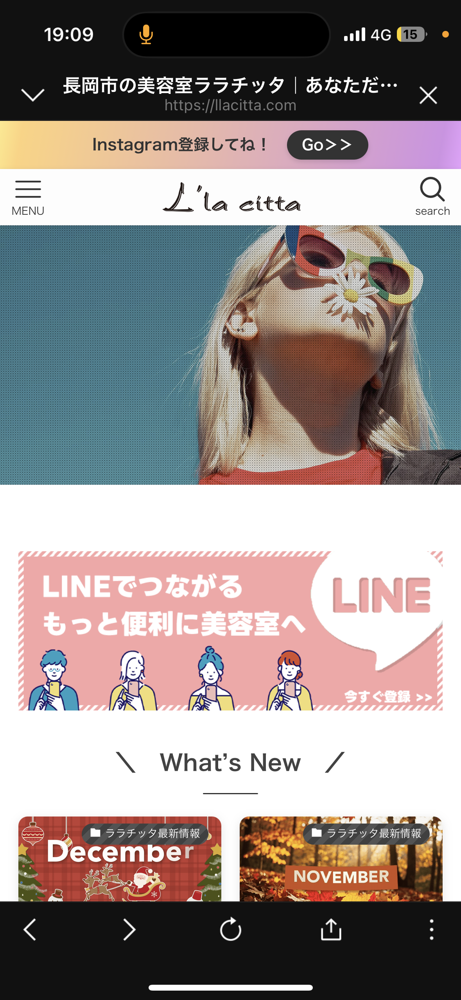
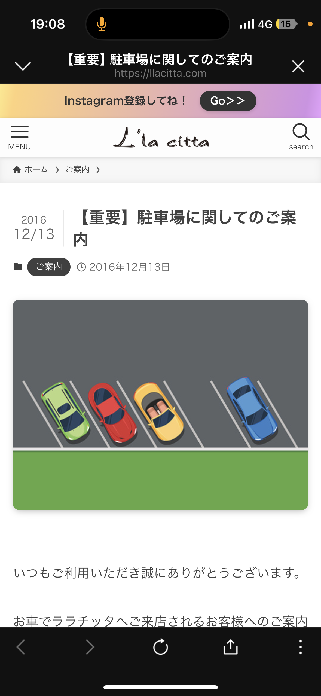
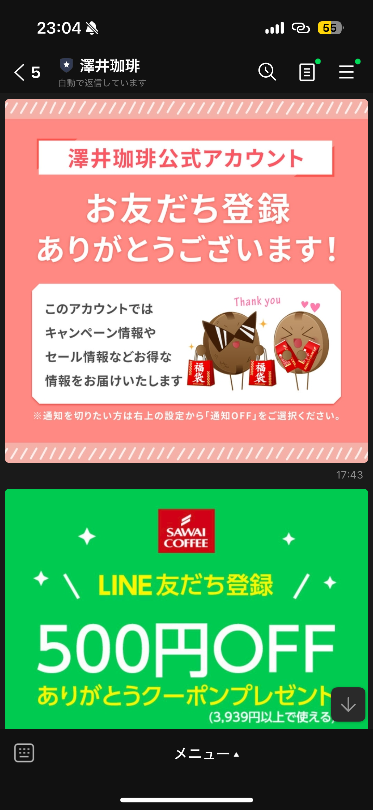

# 公式LINE 市場調査①

**調査日：2025/12/17**

📂 [公式LINE運用管理に戻る](./README.md)

---

## 📝 調査方法

### 参考サイト
- [LINE公式アカウント 活用事例集](https://www.lycbiz.com/jp/service/line-official-account/catalog/)
- 上記カタログサイトから気になったアカウントを選定

### 調査プロセス
1. カタログサイトで各業種の成功事例を確認
2. 気になったアカウントを実際に友だち登録（1アカウント約5分）
3. サイト説明と実際のアカウントを見比べながら特徴を分析
4. ChatGPTと対話しながら要点を整理・まとめ

---

## 📊 調査対象

5つの異業種アカウントを調査し、成功パターンを抽出。

---

## 🔍 調査結果（5アカウント）

### ① ピクシーラッシュ

**業種：** アイラッシュサロン

**URL：**
- 公式LINE：https://page.line.me/372uqddh
- 公式サイト：要確認（LINE内リンクあり）

**要点・特徴：**
- 初回導線としてプロフィールにホームページURLを設置
- 全体構成がシンプル
- ショップカード機能を活用
- プロフィールから基本情報・メニュー確認が可能
- 臨時休業などのお知らせは「投稿」で対応
  - 通知配信は避け、情報は見たい人が見る設計

---

### ② 一粒万福（一汁おにぎり）

**業種：** おにぎり専門店

**URL：**
- 公式LINE：https://page.line.me/559yqhiv
- 公式サイト：https://ichiryu-manpuku.com/

**要点・特徴：**
- 3列リッチメニュー構成
- 最上段に「テイクアウト予約」
- メニューは説明文＋カルーセル型リッチメッセージで表示
- 店舗情報（営業時間／アクセス／マップ／Instagram／公式サイト）が集約
- 事業内容をカルーセルで一覧化する構成が可能
  - （公式／物販／受託など）
- 多言語対応（日本語メニュー・Englishメニュー）
- 店舗情報カード：営業時間・アクセス・Googleマップ連携

**📸 参考画像：**

*左：日本語メニュー・Englishメニュー切り替え　右：テイクアウト予約・店舗情報*

---

### ③ ララチッタ

**業種：** 美容室（新潟県長岡市）

**URL：**
- 公式サイト：https://llacitta.com
- 公式LINE：https://page.line.me/llacitta

**要点・特徴：**
- LINE拝見画面のビジュアル設計を重視
- 来店頻度に合わせた月1回配信
- クーポン・抽選・おみくじ等の体験型要素
- 抽選外れユーザーにも継続利用を促す文言設計
- 広告非利用で友だち約3400人
- LINE経由予約特典あり
- Webサイトは写真多用 → シンプル構成に変更
  - LINE予約導線を明確化
- ヒーロー下にLINE登録CTAを配置
- アンケートを来店当日に配信
- ブロック率約30%を前提に設計
- 駐車場案内など来店に必要な情報を明確化

**📸 参考画像：**

*左：リッチメニューのデザイン　右：店舗詳細・アクセス情報*

*Webサイトでの駐車場案内ページ*

---

### ④ サワイコーヒー

**業種：** コーヒー豆・物販ブランド

**URL：**
- 公式サイト：https://www.sawaicoffee.co.jp/
- 公式LINE：https://page.line.me/sawaicoffee

**要点・特徴：**
- 友だち追加直後にリッチメッセージで割引提示
- 配信内容はキャンペーン・セール中心
- テキスト配信は読まれにくい前提
- リッチメニューで各導線を集約
- 自動返信で受付確認／担当連絡／営業日を明示
- 事業アカウントとしての事務的対応を徹底

**📸 参考画像：**

*リッチメニューと自動返信の設計*

---

### ⑤ ソカナ（ソカナグラシン工房）

**業種：** ペーパーグッズ製造販売

**URL：**
- 公式サイト／ショップ：要確認（SNS・EC中心）
- 公式LINE：要確認

**要点・特徴：**
- プロフィールのフォント設計が印象形成に寄与
- 細い文字＋余白を活かした全体設計
- 友だち追加直後に割引クーポンのリッチメッセージ表示
- 「どこで知ったか」などの軽い対話導線
- 色分けされた3分割リッチメニュー
- 配信頻度を抑え、投稿／LINE BOOMに情報集約
- LINE BOOMの写真品質で世界観を維持

---

## ✅ 5アカウント共通点・成功パターン

### 友だち追加直後の価値提示
- リッチメッセージで即座に価値を提示
- クーポン、割引、特典など

### 通知配信を最小限に
- 一斉配信は最小限
- 情報はリッチメニュー／投稿／カルーセルに集約

### 公式LINEは「全導線のハブ」
- 説明の場ではなく、各サービスへの導線集約
- 予約、購入、問い合わせなどすべてLINEから

### ビジュアル設計の重要性
- 余白／写真／フォントがブランド理解に直結
- 更新頻度が低くても世界観が揃っていれば成立

### 自動応答で効率化
- 最低限の安心感と業務効率を確保
- 営業時間、基本情報は自動返信

---

## 🔗 関連資料

- [StudioJinsei運用方針](./strategy.md)
- [コンテンツ設計](./content/)
